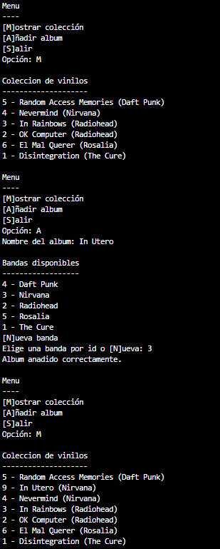
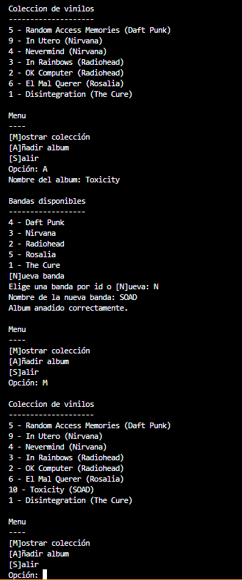

# Práctica: colección de vinilos

## Objetivo

El objetivo de esta práctica es crear una aplicación que permita gestionar una colección personal de vinilos usando una base de datos SQLite.

La aplicación debe permitir:

- mostrar la colección de vinilos;
- añadir un nuevo álbum;
- seleccionar una banda existente;
- crear una banda nueva si todavía no existe;
- relacionar automáticamente el vinilo con su banda.

## Base de datos

La base de datos se crea mediante al ejecución de crear_bd.py, fichero adjunto. Y tiene las siguientes tablas:

### Tabla `grupos`

Guarda las bandas o grupos musicales.

| Campo | Tipo | Restricciones |
|---|---|---|
| `id` | `INTEGER` | `PRIMARY KEY AUTOINCREMENT` |
| `nombre` | `TEXT` | `NOT NULL UNIQUE` |

### Tabla `vinilos`

Guarda los álbumes de la colección.

| Campo | Tipo | Restricciones |
|---|---|---|
| `id` | `INTEGER` | `PRIMARY KEY AUTOINCREMENT` |
| `nombre` | `TEXT` | `NOT NULL` |
| `id_grupo` | `INTEGER` | `NOT NULL`, `FOREIGN KEY` |

Además, se debe evitar que una misma banda tenga repetido el mismo álbum:

```sql
UNIQUE (nombre, id_grupo)
```

## Relación entre tablas

La relación entre `grupos` y `vinilos` es de **1:N**.

Esto significa que:

- un grupo puede tener muchos vinilos;
- cada vinilo pertenece a un único grupo.

Por ese motivo no necesitamos una tabla intermedia. Basta con guardar en la tabla `vinilos` el campo `id_grupo`, que apunta al `id` de la tabla `grupos`.

## Ficheros del proyecto

La práctica se organizará en estos ficheros:

```txt
banda.py
vinilo.py
crear_bd.py
app.py
```

### `crear_bd.py`

Este fichero te lo doy yo y se encargará de:

- crear la base de datos `coleccion_vinilos.bd`;
- crear las tablas `grupos` y `vinilos`;
- insertar algunos datos iniciales.

Este fichero se ejecutará una vez al principio para preparar la base de datos:

```bash
python crear_bd.py
```

### `banda.py`

Contendrá la clase `Banda`.

La clase tendrá:

- `id`;
- `nombre`;
- método `__init__`;
- método `__str__`.

### `vinilo.py`

Contendrá la clase `Vinilo`.

La clase tendrá:

- `id`;
- `nombre`;
- `banda`;
- método `__init__`;
- método `__str__`.


### `app.py`

Este será el programa principal.

Debe mostrar un menú en bucle:

```txt
[M]ostrar coleccion
[A]ñadir album
[S]alir
```

Si el usuario elige `M`, se mostrará la colección completa de vinilos.

Si el usuario elige `A`, el programa pedirá el nombre del álbum. Después mostrará las bandas que ya existen en la base de datos y permitirá:

- seleccionar una banda por su `id`;
- crear una banda nueva.

Si se crea una banda nueva, el vinilo se enlazará directamente con esa banda.

Si el usuario elige `S`, el programa terminará.


## Ejemplo de ejecución



## Requisitos

El programa debe:

- usar SQLite con el módulo `sqlite3`;
- usar `Path` para que la base de datos se cree en la misma carpeta que los scripts;
- usar consultas parametrizadas con `?`;
- activar las claves ajenas con `PRAGMA foreign_keys = ON`;
- cerrar la conexión al terminar;
- usar anotación de tipos en las cabeceras de funciones y métodos;
- usar las clases `Banda` y `Vinilo`.

## Evaluación


### Cumplimiento de requisitos: 50 puntos

Este apartado se valorará en bloques de 10 puntos.

| Puntuación | Criterio |
|---|---|
| 50 puntos | La práctica cumple todos los requisitos pedidos. |
| 40 puntos | La práctica cumple la mayoría de los requisitos, con algún fallo menor. |
| 30 puntos | La práctica funciona parcialmente, pero faltan varios requisitos importantes. |
| 20 puntos | La práctica tiene una estructura incompleta o errores relevantes de funcionamiento. |
| 10 puntos | La práctica apenas cumple algún requisito básico. |
| 0 puntos | La práctica no se entrega o no se puede ejecutar. |

### Pregunta 1 sobre el código: 15 puntos

El profesor realizará preguntas al alumno sobre su código para comprobar que entiende lo que ha hecho.

| Puntuación | Criterio |
|---|---|
| 15 puntos | Responde correctamente y demuestra comprensión clara del código. |
| 10 puntos |Responde correctamente, aunque con alguna duda, imprecisión o tarda en responder. |
| 5 puntos | Responde de forma muy parcial o necesita mucha ayuda. |
| 0 puntos | No sabe explicar el código entregado. |

### Pregunta 2 sobre el código: 15 puntos

El profesor realizará preguntas al alumno sobre su código para comprobar que entiende lo que ha hecho.

| Puntuación | Criterio |
|---|---|
| 15 puntos | Responde correctamente y demuestra comprensión clara del código. |
| 10 puntos | Responde correctamente, aunque con alguna duda, imprecisión o tarda en responder. |
| 5 puntos | Responde de forma muy parcial o necesita mucha ayuda. |
| 0 puntos | No sabe explicar el código entregado. |

### Resolución de error: 20 puntos

El profesor introducirá un error en el código del alumno.

El alumno deberá localizarlo, explicar qué ocurre y corregirlo.

| Puntuación | Criterio |
|---|---|
| 20 puntos | Encuentra el error, explica la causa y lo corrige correctamente. |
| 10 puntos | Encuentra el error o se acerca a la solución, pero necesita ayuda para corregirlo. |
| 0 puntos | No consigue localizar ni resolver el error. |
